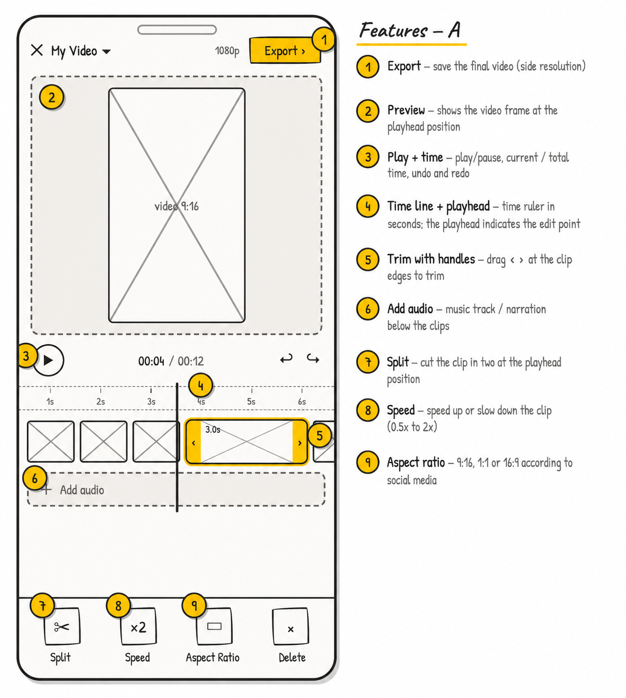

# video_ultra_player

A Flutter plugin for previewing and exporting a native media timeline made from
local video and image files.

`video_ultra_player` builds one native composition per timeline, renders it into
a single Flutter `Texture`, and can export the same timeline as an MP4 file. This
avoids the visible flash or gap that often appears when switching between
multiple Flutter video players at clip boundaries.

---



---

## Features

- Gapless native timeline preview in one Flutter `Texture`.
- MP4 export with real-time progress stream.
- Video and image clips in the same timeline.
- Playback controls: play, pause, seek, seekToClip, volume.
- Timeline state stream with global position, local clip position, clip index,
  playing state, total duration, per-clip durations, and undo/redo availability.
- Non-destructive clip editing: trim, split, insert, remove, move, replace.
- Per-clip speed (0.5× – 2×) and pan/crop with normalized alignment values.
- Overlay audio track with offset, volume, trim, fade-in, and fade-out.
- Undo/redo with `canUndo` / `canRedo` flags surfaced in the state stream.
- Clip-to-clip crossfade transitions.
- Filmstrip thumbnail generation from any video file.
- Output aspect ratio presets: 9:16, 1:1, 16:9, or original.
- Export resolution control via `baseWidth`.
- Export the current loaded timeline without re-passing the clip list.
- iOS implementation backed by AVFoundation.
- Android implementation backed by AndroidX Media3.

## Platform support

| Platform | Preview | Export | Native implementation |
| --- | --- | --- | --- |
| iOS | Yes | Yes | AVFoundation, FlutterTexture, AVAssetExportSession |
| Android | Yes | Yes | Media3 CompositionPlayer, Transformer, SurfaceTexture |
| Web | No | No | Not implemented |
| macOS / Windows / Linux | No | No | Not implemented |

## Getting started

```bash
flutter pub add video_ultra_player
```

```dart
import 'package:video_ultra_player/video_ultra_player.dart';
```

The plugin works with local file paths. Resolve assets, downloads, camera
captures, or photo-library items to an absolute local path before calling any
API.

## Basic usage

Create a player and define the timeline:

```dart
final player = NativeTimelinePlayer();

final clips = <TimelineClip>[
  const TimelineClip(
    path: '/local/path/intro.mp4',
    type: MediaType.video,
  ),
  const TimelineClip(
    path: '/local/path/title-card.png',
    type: MediaType.image,
    duration: Duration(seconds: 3),
  ),
  const TimelineClip(
    path: '/local/path/outro.mp4',
    type: MediaType.video,
  ),
];
```

Load the native composition and render the texture:

```dart
final textureId = await player.load(clips);

AspectRatio(
  aspectRatio: 16 / 9,
  child: Texture(textureId: textureId),
);
```

Control playback:

```dart
await player.play();
await player.pause();
await player.seekTo(const Duration(milliseconds: 1500));
await player.seekToClip(2);   // jump to the start of clip at index 2
await player.setVolume(0.8);
```

Listen to timeline state:

```dart
StreamBuilder<TimelinePlayerState>(
  stream: player.stateStream,
  builder: (context, snapshot) {
    final state = snapshot.data ?? const TimelinePlayerState.initial();

    return Text(
      'Clip ${state.clipIndex + 1} / ${state.clipDurations.length} — '
      '${state.globalPosition.inMilliseconds} ms — '
      'undo: ${state.canUndo}  redo: ${state.canRedo}',
    );
  },
);
```

Dispose when done:

```dart
@override
void dispose() {
  player.dispose();
  super.dispose();
}
```

## Editing clips

All edits are applied to the live native composition. The player emits a new
`TimelinePlayerState` after each operation.

### Trim

```dart
await player.trimClip(
  0,
  trimStart: const Duration(seconds: 1),
  trimEnd: const Duration(seconds: 8),
);
```

Both `trimStart` and `trimEnd` are optional. Pass only the side you want to
change.

### Split

```dart
// Cut clip at index 1 into two, at 3 s into that clip.
await player.splitClip(1, const Duration(seconds: 3));
```

### Insert

```dart
await player.insertClip(
  2,
  const TimelineClip(path: '/local/path/b-roll.mp4', type: MediaType.video),
);
```

### Remove

```dart
await player.removeClip(2);
```

### Reorder

```dart
await player.moveClip(0, 2); // move clip from index 0 to index 2
```

### Replace

```dart
await player.replaceClip(
  1,
  const TimelineClip(path: '/local/path/new-clip.mp4', type: MediaType.video),
);
```

### Per-clip speed

```dart
await player.setClipSpeed(0, 0.5);  // slow motion
await player.setClipSpeed(1, 2.0);  // fast forward
```

### Pan/crop alignment

```dart
await player.setClipAlignment(0, 0.4, -0.2);
```

Alignment values use the `-1.0..1.0` range on both axes. Keep your
`TimelineClip` list updated with the latest `Alignment` values before exporting.

## Audio track

Attach one overlay audio track (music or narration) to the entire timeline:

```dart
await player.setAudioTrack(
  const AudioTrack(
    path: '/local/path/background.mp3',
    offset: Duration(seconds: 2),   // where in the timeline the track starts
    volume: 0.7,
    fadeIn: Duration(milliseconds: 500),
    fadeOut: Duration(seconds: 1),
  ),
);
```

Remove the audio track:

```dart
await player.removeAudioTrack();
```

`AudioTrack` also supports `trimStart` and `trimEnd` to use only a segment of
the source file.

## Undo / Redo

```dart
await player.undo();
await player.redo();
```

`TimelinePlayerState.canUndo` and `canRedo` reflect the current history stack
state so you can enable or disable buttons reactively.

## Clip transitions

Add a crossfade between two adjacent clips via `TimelineClip.transitionToNext`:

```dart
TimelineClip(
  path: '/local/path/clip-a.mp4',
  type: MediaType.video,
  transitionToNext: const ClipTransition(
    type: TransitionType.crossfade,
    duration: Duration(milliseconds: 500),
  ),
)
```

Use `TransitionType.none` (the default) for a hard cut.

## Output aspect ratio and resolution

Pass a `TimelineCompositionConfig` to `load` or `exportTimeline`:

```dart
const config = TimelineCompositionConfig(
  aspectRatio: OutputAspectRatio.ratio9x16,
  baseWidth: 1080,
);

final textureId = await player.load(clips, config: config);
```

| `OutputAspectRatio` | Description |
| --- | --- |
| `ratio16x9` | 16:9 landscape |
| `ratio9x16` | 9:16 portrait (Reels/Shorts) |
| `ratio1x1` | 1:1 square |
| `original` | Matches the first clip (default) |

`baseWidth` controls horizontal resolution; height is derived from the ratio.

## Exporting MP4

### From a clip list

```dart
final outputPath = await player.exportTimeline(
  clips,
  outputPath: '/local/path/final-video.mp4',
  config: const TimelineCompositionConfig(
    aspectRatio: OutputAspectRatio.ratio9x16,
  ),
);
```

`outputPath` is optional — the platform creates a temp file and returns its
path when omitted.

### From the current loaded timeline

```dart
final outputPath = await player.exportCurrentTimeline(
  outputPath: '/local/path/final-video.mp4',
);
```

`exportCurrentTimeline` uses the composition already in memory. Call it after
`load` to avoid re-passing the clip list.

### Track export progress

```dart
StreamBuilder<TimelineExportProgress>(
  stream: player.exportProgress,
  builder: (context, snapshot) {
    final p = snapshot.data ?? const TimelineExportProgress.idle();

    if (p.state == TimelineExportState.exporting) {
      return LinearProgressIndicator(value: p.progress);
    }
    if (p.state == TimelineExportState.completed) {
      return const Text('Export complete');
    }
    return const SizedBox.shrink();
  },
);
```

## Filmstrip thumbnails

Generate JPEG thumbnails from any local video file without loading a player:

```dart
final paths = await player.generateThumbnails(
  '/local/path/clip.mp4',
  [
    Duration.zero,
    const Duration(seconds: 1),
    const Duration(seconds: 2),
  ],
  width: 120,
);
// paths is a List<String> of absolute JPEG file paths
```

## Loading videos from the gallery

Gallery picking is intentionally not built into this plugin. Use a picker
package in your app, then pass the returned local paths to `video_ultra_player`.

Example using `image_picker`:

```yaml
dependencies:
  image_picker: ^1.2.2
  video_ultra_player: ^1.0.0
```

```dart
import 'package:image_picker/image_picker.dart';
import 'package:video_ultra_player/video_ultra_player.dart';

final picker = ImagePicker();
final player = NativeTimelinePlayer();

final videos = await picker.pickMultiVideo();
if (videos.isNotEmpty) {
  final clips = videos
      .map((v) => TimelineClip(path: v.path, type: MediaType.video))
      .toList();

  final textureId = await player.load(clips);
  final outputPath = await player.exportCurrentTimeline();
}
```

iOS photo-library usage description (`ios/Runner/Info.plist`):

```xml
<key>NSPhotoLibraryUsageDescription</key>
<string>Select videos from your library to preview and export them.</string>
<key>NSPhotoLibraryAddUsageDescription</key>
<string>Save exported videos to your gallery.</string>
```

## API reference

### TimelineClip

```dart
const TimelineClip({
  required String path,
  required MediaType type,
  Duration? duration,
  Alignment alignment = Alignment.center,
  double scale = 1.0,
  double speed = 1.0,
  Duration? trimStart,
  Duration? trimEnd,
  ClipTransition? transitionToNext,
})
```

| Property | Description |
| --- | --- |
| `path` | Absolute local file path. |
| `type` | `MediaType.video` or `MediaType.image`. |
| `duration` | Segment duration. Recommended for images (default: 2 s). |
| `alignment` | Initial pan/crop alignment (`-1.0..1.0` on each axis). |
| `scale` | Crop/zoom scale. Must be greater than zero. |
| `speed` | Playback speed multiplier (0.5 – 2.0). |
| `trimStart` | Source offset where the clip starts. |
| `trimEnd` | Source position where the clip ends. |
| `transitionToNext` | Transition to the following clip. |

### AudioTrack

| Property | Description |
| --- | --- |
| `path` | Absolute local path of the audio file. |
| `offset` | Where in the timeline the track starts (default: `Duration.zero`). |
| `volume` | Amplitude multiplier `0.0..1.0` (default: `1.0`). |
| `trimStart` | Start offset inside the source file. |
| `trimEnd` | End position inside the source file. |
| `fadeIn` | Fade-in duration at the start of the track. |
| `fadeOut` | Fade-out duration at the end of the track. |

### ClipTransition

| Property | Description |
| --- | --- |
| `type` | `TransitionType.none` or `TransitionType.crossfade`. |
| `duration` | Duration of the transition overlap. |

### TimelineCompositionConfig

| Property | Description |
| --- | --- |
| `aspectRatio` | Output aspect ratio (`ratio16x9`, `ratio9x16`, `ratio1x1`, `original`). |
| `baseWidth` | Horizontal resolution in pixels (default: `1080`). |

### TimelinePlayerState

| Property | Description |
| --- | --- |
| `globalPosition` | Current position in the full timeline. |
| `clipIndex` | Index of the active clip. |
| `localPosition` | Current position inside the active clip. |
| `isPlaying` | Whether the native player is currently playing. |
| `totalDuration` | Total duration of the timeline. |
| `clipDurations` | Resolved duration of each clip in the timeline. |
| `canUndo` | Whether an undo snapshot is available. |
| `canRedo` | Whether a redo snapshot is available. |

### TimelineExportProgress

| Property | Description |
| --- | --- |
| `progress` | Normalized export progress `0.0..1.0`. |
| `state` | `idle`, `exporting`, `completed`, or `failed`. |

### NativeTimelinePlayer

| Member | Description |
| --- | --- |
| `load(clips, {config})` | Builds the native composition and returns a `textureId`. |
| `exportTimeline(clips, {outputPath, config})` | Exports a clip list to MP4. |
| `exportCurrentTimeline({outputPath})` | Exports the loaded composition to MP4. |
| `play()` | Starts playback. |
| `pause()` | Pauses playback. |
| `seekTo(Duration)` | Seeks to a global timeline position. |
| `seekToClip(int)` | Jumps to the start of the clip at the given index. |
| `setVolume(double)` | Sets volume `0.0..1.0`. |
| `setClipAlignment(int, double, double)` | Updates pan/crop alignment for a clip. |
| `trimClip(int, {trimStart, trimEnd})` | Trims in or out point of a clip. |
| `splitClip(int, Duration)` | Cuts a clip into two at the given local position. |
| `insertClip(int, TimelineClip)` | Inserts a clip at the given index. |
| `removeClip(int)` | Removes the clip at the given index. |
| `moveClip(int, int)` | Moves a clip from one index to another. |
| `replaceClip(int, TimelineClip)` | Replaces the clip at the given index. |
| `setClipSpeed(int, double)` | Sets the speed for a clip (0.5 – 2.0). |
| `setAudioTrack(AudioTrack)` | Attaches an overlay audio track. |
| `removeAudioTrack()` | Removes the overlay audio track. |
| `undo()` | Reverts the last edit operation. |
| `redo()` | Re-applies the last undone operation. |
| `generateThumbnails(path, timestamps, {width})` | Returns a list of JPEG paths. |
| `stateStream` | Broadcast stream of `TimelinePlayerState`. |
| `exportProgress` | Broadcast stream of `TimelineExportProgress`. |
| `textureId` | Current Flutter texture id after `load`. |
| `isLoaded` | Whether a composition is currently loaded. |
| `dispose()` | Releases native player and texture resources. |

## Example app

The `example/` app demonstrates:

- Loading bundled sample assets.
- Selecting multiple videos and images from the gallery with `image_picker`.
- Rendering the native timeline in a Flutter `Texture`.
- Playback, scrubbing, volume, and pan/crop.
- Trim, split, reorder, and remove clips.
- Per-clip speed control.
- Overlay audio track with fade.
- Undo/redo.
- Aspect ratio switching.
- Export progress tracking.
- Saving the exported MP4 to the gallery.

Run it with:

```bash
cd example
flutter run
```

To scaffold the complete editor UI into your own app, use the
[`implement-video-editor`](https://github.com/andrelucassvt/video-ultra-player/tree/master/.claude/skills/implement-video-editor)
Claude Code skill. It copies the proven dark CapCut-like design (timeline
widgets, trim handles, ruler, playhead, and media picker) into your app, wires
navigation, sets up dependencies and native permissions, and verifies the
result — no hand-coding the timeline widgets.

## Technical notes

- `load` and `exportTimeline` reject empty clip lists.
- Playback methods and `stateStream` require `load` to complete first.
- `exportCurrentTimeline` requires `load` to complete first.
- `exportTimeline` is independent from the preview player and can be called
  without loading a texture.
- Image clips use a default duration of 2 seconds when `duration` is omitted.
- iOS image clips are converted to temporary MP4 segments before composition.
- Android rebuilds the Media3 composition when live pan/crop changes because
  Media3 effects are immutable.
- The plugin returns local output paths; it does not save exported files to the
  user's gallery automatically — use `gal` or a similar package for that.

## Development

Run package checks:

```bash
flutter analyze
flutter test
```

Run example checks:

```bash
cd example
flutter test
flutter build apk --debug
flutter build ios --debug --simulator
```

For implementation details, see
[`flow/native-timeline-player.md`](flow/native-timeline-player.md).
